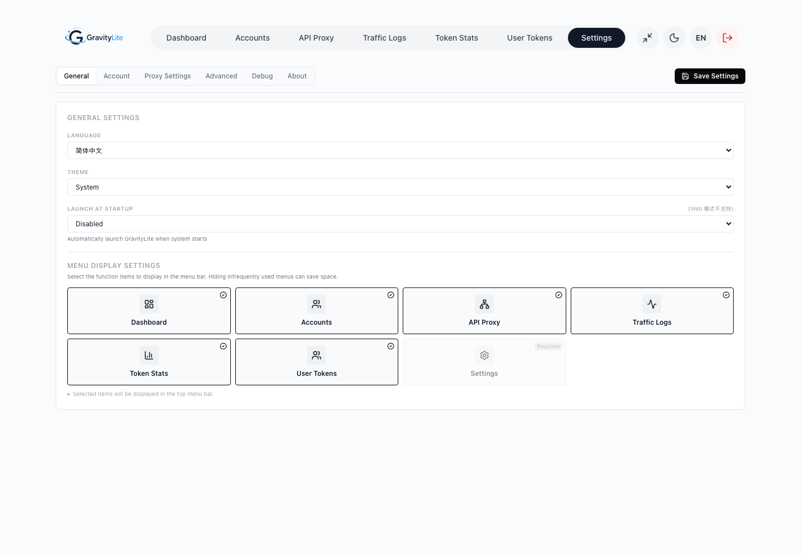
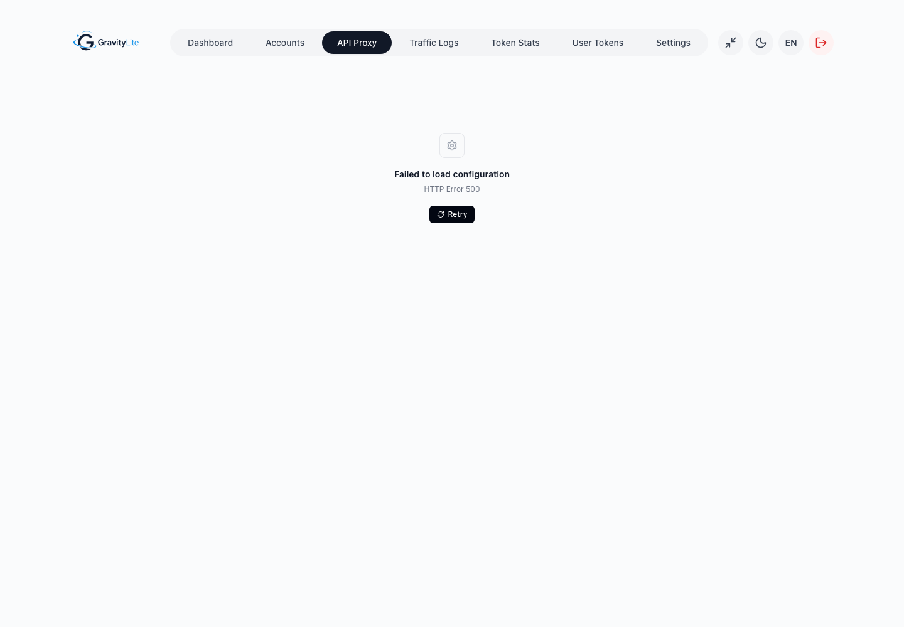
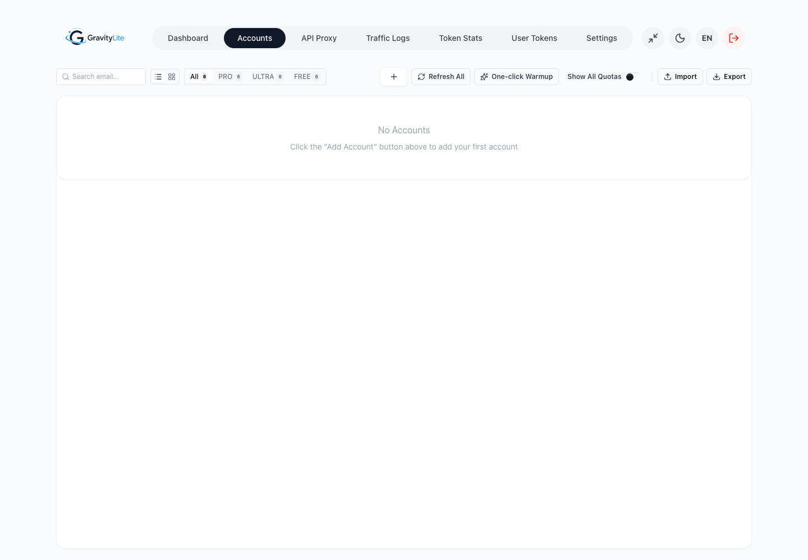

<div align="center">
  

  <h1>GravityLite</h1>

  <p>
    A focused desktop manager for AI accounts, quotas, user tokens, and local OpenAI, Anthropic, and Gemini-compatible proxying.
  </p>

  <p>
    <a href="https://github.com/bernardthimotius/GravityLite">Repository</a>
    ·
    <a href="https://github.com/bernardthimotius">Maintainer</a>
    ·
    <a href="https://www.linkedin.com/in/bernardtrnp/">LinkedIn</a>
    ·
    <a href="https://github.com/lbjlaq/Antigravity-Manager">Upstream</a>
  </p>

  <p>
    <strong>Version 1.0.0</strong>
    ·
    <strong>License: CC BY-NC-SA 4.0</strong>
  </p>
</div>

## Overview

GravityLite is a cleaned-up and opinionated fork of [Antigravity-Manager](https://github.com/lbjlaq/Antigravity-Manager). It keeps the parts that matter for day-to-day usage: account management, quota visibility, user token access control, and a local protocol-compatible proxy for tools that speak OpenAI, Anthropic, or Gemini-style APIs.

The project exists because the original application had grown into a broad tool with many experimental surfaces, unused model mappings, and UI areas that were not necessary for a smaller, more predictable workflow. GravityLite trims that surface down and reworks the experience around clarity, stable model exposure, and practical proxy operation.

GravityLite is maintained by [Bernard Thimotius Turnip](https://github.com/bernardthimotius). It preserves upstream attribution and remains under the same Creative Commons Attribution-NonCommercial-ShareAlike 4.0 International license.

## Why GravityLite

GravityLite was created to make the application easier to understand, run, and maintain.

- A simpler interface with less visual noise and fewer unused controls.
- A focused proxy page for local OpenAI, Anthropic, and Gemini-compatible clients.
- A fixed and explicit model list instead of broad unused mapping surfaces.
- Cleaner account, quota, token, and traffic monitoring workflows.
- Preserved attribution to the original Antigravity-Manager project.
- A project identity that clearly separates this fork from upstream while respecting the original license.

## Screenshots

<p align="center">
  
  
  
</p>

## Core Features

- Account management for local AI client credentials and quota-aware account switching.
- Quota views with a fixed, predictable model order.
- Local proxy endpoints for OpenAI-compatible, Anthropic-compatible, and Gemini-compatible clients.
- User token management with IP limits and curfew timezone controls.
- Traffic monitoring and token statistics for operational visibility.
- CLI configuration helpers for supported external tools.
- Neutral, minimal interface refinements across settings, accounts, proxy, tokens, and modals.

## Supported Proxy Model Set

GravityLite intentionally exposes a fixed model set instead of a large compatibility mapping surface.

- `claude-opus-4-6-thinking`
- `claude-sonnet-4-6`
- `gemini-pro-agent`
- `gemini-3.1-pro-high`
- `gemini-3.1-pro-low`
- `gemini-3-flash`
- `gemini-3-flash-agent`
- `gemini-3.5-flash-low`
- `gemini-3.5-flash-extra-low`
- `gemini-3.1-flash-image`
- `gemini-3.1-flash-lite`
- `gemini-2.5-pro`
- `gemini-2.5-flash`
- `gemini-2.5-flash-thinking`
- `gemini-2.5-flash-lite`
- `gpt-oss-120b-medium`

## Quick Start

### Prerequisites

- Node.js
- Rust toolchain
- Tauri prerequisites for your operating system

### Install Dependencies

```bash
npm install
```

### Run in Development

```bash
npm run tauri dev
```

### Build Frontend

```bash
npm run build
```

### Check Backend

```bash
cd src-tauri
cargo check
```

## Local Proxy Usage

When the proxy service is enabled, external clients can connect to the local base URL shown in the API Proxy page.

OpenAI-compatible example:

```bash
curl http://127.0.0.1:8045/v1/models \
  -H "Authorization: Bearer YOUR_API_KEY"
```

Typical client configuration:

```text
Base URL: http://127.0.0.1:8045/v1
API Key:  generated in GravityLite
Model:    one of the supported model IDs
```

## Project Structure

```text
src/                  React frontend
src-tauri/            Rust and Tauri backend
src/assets/           Application logos and frontend assets
docs/images/          README and documentation screenshots
LICENSE               Upstream license, CC BY-NC-SA 4.0
NOTICE.md             Attribution and fork notice
CHANGELOG.md          GravityLite release history
SECURITY.md           Security reporting and credential guidance
CONTRIBUTING.md       Contribution guidelines
```

## Attribution

GravityLite is adapted from [Antigravity-Manager](https://github.com/lbjlaq/Antigravity-Manager) by [lbjlaq](https://github.com/lbjlaq).

This fork is maintained by [Bernard Thimotius Turnip](https://github.com/bernardthimotius), with project repository planned at [bernardthimotius/GravityLite](https://github.com/bernardthimotius/GravityLite).

See [NOTICE.md](NOTICE.md) for the full attribution notice.

## License

This repository is licensed under Creative Commons Attribution-NonCommercial-ShareAlike 4.0 International.

In practical terms, redistribution and adaptation must preserve attribution, indicate modifications, remain non-commercial, and use compatible share-alike licensing. See [LICENSE](LICENSE) for the full license text.

## Security

GravityLite handles sensitive local credentials, API keys, user tokens, OAuth refresh tokens, and account data. Do not publish real configuration files, account exports, `.antigravity_tools` contents, screenshots containing tokens, or debug logs that may contain request payloads.

See [SECURITY.md](SECURITY.md) for reporting and handling guidance.

## Responsible Use

GravityLite is provided as a local account management and protocol compatibility tool. It is not intended to bypass quotas, evade rate limits, circumvent access controls, or violate the terms of any upstream service.

Users are solely responsible for how they configure and use GravityLite, including compliance with applicable laws, provider terms of service, account policies, rate limits, and data handling requirements.

The maintainer does not endorse misuse of this software and is not responsible for account suspension, quota restrictions, service termination, data loss, or other consequences resulting from improper or unauthorized use.

## Account Pooling Notice

GravityLite may allow users to organize multiple local accounts for convenience and visibility. Users must ensure that any multi-account usage is permitted by the relevant upstream service policies.

Do not use GravityLite to evade quotas, rotate accounts to bypass rate limits, share unauthorized access, resell access, or automate activity that violates provider terms.
